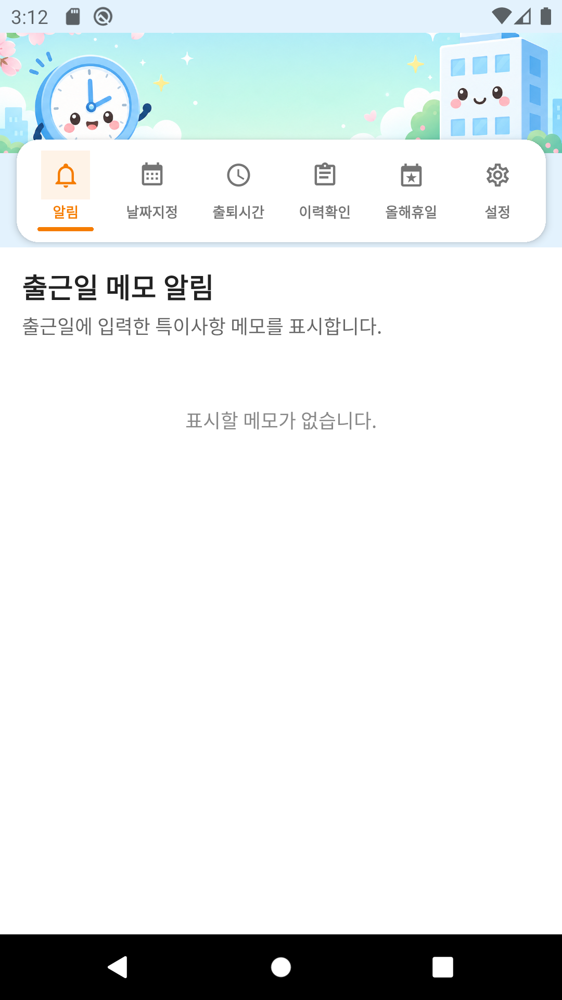
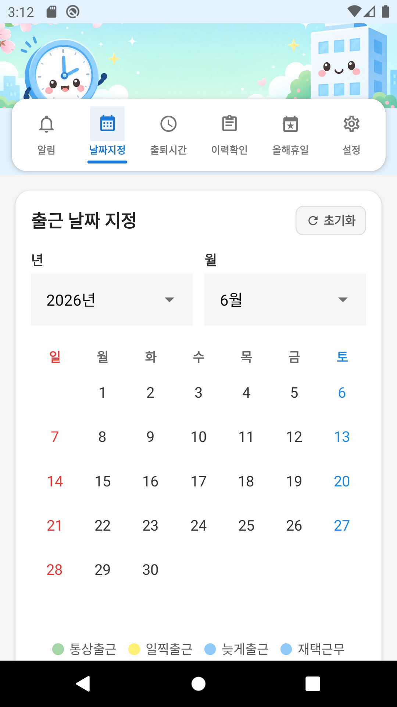
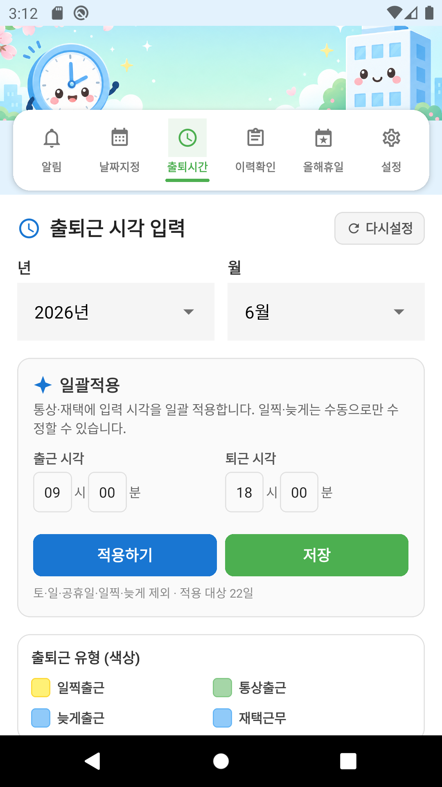
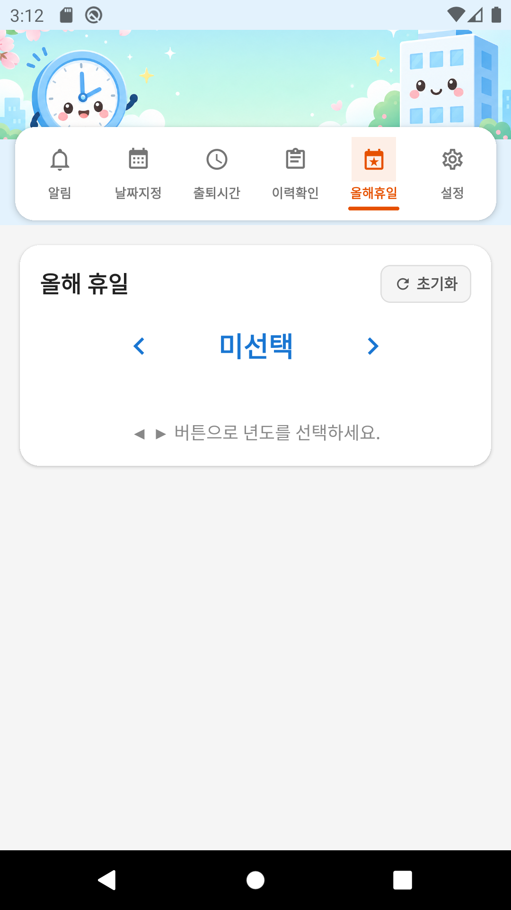

# Commute Manager (Work Attendance App)

**Program Name:** Commute Manager (`출퇴근 관리` / `出退勤管理`)  
**Version:** 1.0.0  
**Package ID:** `com.commuteapp`

A React Native mobile application for managing office attendance dates and types, commute times, attendance history, Japanese holidays, and settings (multi-language, arrival types, break times, CSV export, email).

---

## Development Environment & Packages

### Required Environment

| Item | Version |
|------|---------|
| Node.js | 18 or higher (20.x recommended) |
| npm | 8+ |
| JDK | 17 (for Android APK build) |
| Android SDK | API 34 (Android 14) |
| Android Build Tools | 34.x |

### Core Framework

| Package | Version | Purpose |
|---------|---------|---------|
| expo | ~51.0.28 | React Native framework & build tools |
| react | 18.2.0 | UI library |
| react-native | 0.74.5 | Mobile runtime |
| typescript | ~5.3.3 | Type-safe development |

### Navigation & UI

| Package | Version | Purpose |
|---------|---------|---------|
| @react-navigation/native | ^6.1.18 | App navigation |
| @react-navigation/material-top-tabs | ^6.6.14 | Top tab menu |
| react-native-tab-view | ^3.5.2 | Tab view component |
| react-native-pager-view | 6.3.0 | Swipeable tabs |
| react-native-safe-area-context | 4.10.5 | Safe area layout |
| react-native-screens | 3.31.1 | Native screen containers |
| @react-native-picker/picker | 2.7.5 | Year/month/day pickers |

### Data & Storage

| Package | Version | Purpose |
|---------|---------|---------|
| @react-native-async-storage/async-storage | 1.23.1 | Local data persistence |

### Settings Features (Export & Email)

| Package | Version | Purpose |
|---------|---------|---------|
| expo-file-system | ~17.0.1 | CSV file creation |
| expo-sharing | ~12.0.1 | Share / save CSV files |
| expo-mail-composer | ~13.0.1 | Native email composer |
| expo-document-picker | ~12.0.2 | File attachment selection |

### Install & Run

```bash
nodebrew use v20.18.0   # or any Node 18+
npm install
npm run android:emu     # Android emulator
npm start               # Expo dev server
```

### Build APK

```bash
npm run build:apk
# Output: dist/出退勤管理-v1.0.0.apk
```

A pre-built APK is also committed in the repository:

```
dist/出退勤管理-v1.0.0.apk
```

---

## Supported Android Versions

| | |
|---|---|
| **Minimum** | Android 6.0 (API 23, Marshmallow) |
| **Target** | Android 14 (API 34) |
| **Compile SDK** | API 34 |

The app runs on **Android 6.0 and above**. It is optimized for Android 14.

---

## Features

The app features a **cute top banner** with **six link-button menus overlaid on the banner image**: **Alerts · Dates · Times · History · Holidays · Settings**. The default display language is **Japanese** (configurable to Chinese, Korean, or English in Settings).

**Manuals in other languages:** [한국어](README_KO.md) · [日本語](README_JP.md) · [中文](README_ZH.md)

---

### 1. Alerts (Work Day Memos)

Shows special notes entered on office days as a date card list.

**How to use:**
- Only dates marked as office days in **Dates** with a saved memo in **Times** are shown
- Format: `YYYY/MM/DD(weekday):arrival type(clock-in)` / `Memo:text`
- Clock-in uses saved commute time first, otherwise the arrival type default from Settings
- Example:
```
2026/06/11(Thu):Normal(09:00)
Memo:Release work for blended data update
```
- Newest dates appear at the top



---

### 2. Set Work Dates

Select office attendance days and arrival types on a monthly calendar.

**How to use:**
- Choose **year** and **month** using the same dropdown pickers as Attendance History
- Select an **arrival type button** (Normal · Early · Late · Remote · Vacation), then tap a date to mark it
- Marked dates show the **configured color** for that type
- Double-tap quickly on a marked date to unmark it
- **Japanese national holidays** are shown with a **red circle** on the calendar
- Tap **Reset** (next to the title) to clear all work dates for the month
- Legend: five arrival-type colors + red dot = holiday

**Default arrival times (configurable in Settings):**
| Type | Default clock-in | Default clock-out |
|------|------------------|-------------------|
| Normal | 08:40 | clock-in + 8 h |
| Early | 06:00 | 16:00 |
| Late | 11:00 | 20:00 |
| Remote | 08:40 | clock-in + 8 h |
| Vacation | — | — |



---

### 3. Commute Times

Enter clock-in and clock-out times for each day of the selected month.

**How to use:**
- Select **year** and **month** using the same dropdown pickers as Attendance History
- In the **Bulk Apply** section, enter clock-in / clock-out times, then tap **Apply** and **Save** side by side
- Edit each day individually with compact **HH hours MM minutes** inputs
- Enter special notes in each day's **Memo** field
- Tap **Reset** (next to the title) to clear all times and memos for the month to **00:00** / empty
- Tap **Save** to store data and show a preview list below

**Color legend (below Bulk Apply):**
- **Early · Normal · Late · Remote** — matches arrival-type colors from Settings

**Save preview (same format as Attendance History):**
- **First line:** `[Work hours:total]` — sum of daily work hours (one decimal place)
- Each row: `YYYY/MM/DD(weekday) HH:MM-HH:MM (work hours)`, center-aligned
- Appends `[Memo:text]` when a memo exists
- Work hours = clock-out − clock-in − **morning, lunch, and dinner breaks** (see Settings), decimal in parentheses (`9.0`, `9.5`)
- **Vacation** days are excluded from the total

**Day labels and card colors:**
- Each row shows `YYYY/MM/DD(weekday):type`
- Card colors follow **arrival-type colors** from Settings (normal, early, late, remote, vacation)
- **Weekday, not marked on calendar** → `:Remote`
- **Saturday, Sunday, or holiday, not marked** → `:Holiday` (gray card)
- **Saturday, Sunday, or holiday marked on calendar** → `:Office` by default; tap the date label (▼) to switch **Office / Remote**
- **Holiday work days** default to **08:40–17:40** (editable per day)

**Bulk apply rules:**
- Applies to **normal and remote** weekdays only (**early, late, and vacation are manual edit only**)
- **Excludes Saturdays, Sundays, and Japanese national holidays** (fixed holidays, Happy Monday, equinox days, substitute holidays, citizens' holidays)
- Screen shows eligible day count (e.g. `Excludes Sat/Sun & JP holidays · N days`)



---

### 4. Attendance History (出勤履歴確認)

View monthly attendance records.

**How to use:**
- Select year and month with dropdown pickers
- The list updates automatically for the selected month
- **First line:** `[Work hours:total]` — sum of daily work hours for all days in the month
- Each row shows `YYYY/MM/DD(weekday) HH:MM-HH:MM (work hours)`, **center-aligned**
- Work hours in parentheses use the same decimal format as the save preview (lunch and dinner breaks excluded)
- Example:
```
[Work hours:160.0]
2026/06/03(Wed) 09:00-18:00 (8.0)
2026/06/04(Thu) 09:00-18:00 (8.0)
```
- Card colors and type labels match Commute Times (per arrival-type colors)


---

### 5. Year Holidays (今年祝日)

View Japanese national holidays by year and month.



---

### 6. Settings

Display language, arrival types, break times, attendance report (CSV), and email.

#### 6-1. Display Language
Choose **Japanese · Chinese · Korean · English** (in that order). All screens update immediately.

#### 6-2. Arrival Type, Color & Time
- **Normal / Early / Late / Remote** — set display color and clock-in time (clock-out auto-calculated; early/late keep fixed clock-out)
- **Vacation** — display color only (excluded from work-hour totals)
- Tap the full-width **Save** button at the bottom to apply

#### 6-3. Break Time Settings
- Card: **Break Time (Lunch, Dinner)** under category **Break Time Settings**
- **Morning break** (excluded from work hours) — default **1 hour**; deducted only when clock-in is **before 08:00**
- **Lunch break** (excluded from work hours) — default **1 hour**; **not** applied on vacation days
- **Dinner break** (excluded from work hours) — default **0 hours**
- Edit hour and minute for each field independently; tap **Save** below to apply all three
- Saved breaks are subtracted on History, save preview, and CSV export

#### 6-4. Attendance Report (CSV)
- Select export month
- Tap the full-width **Export** button to generate and share a CSV file (uses §6-2 arrival types and §6-3 break times)

**CSV format example:**
```
2026年 06月 出勤履歴
01日: 出勤時刻:09:00、退勤時刻:18:00、稼働時間:08時間00分
...
[総勤務時間:160時間00分]
```

#### 6-5. Send Email
- Enter recipient, subject, and body
- Attach files (including exported CSV)
- Tap the full-width **Send Email** button to open the device mail app


---

## Feature Updates

| Item | Description |
|------|-------------|
| Menu layout | **Alerts · Dates · Times · History · Holidays · Settings** (6 tabs) |
| Project rename | `googleCalenderApp` → **CommuteApp** (`commute-app`, `com.commuteapp`) |
| Work dates | Mark days with **Normal / Early / Late / Remote / Vacation** type buttons and colors |
| Arrival defaults | Normal 08:40 / Early 06:00–16:00 / Late 11:00–20:00 / Remote 08:40 / Vacation |
| Bulk apply | **Normal & remote** weekdays only; early/late/vacation manual; **Apply** and **Save** side by side |
| Holiday work | Default **08:40–17:40** when marking Sat/Sun/holidays on calendar |
| Color legend | Early · Normal · Late · Remote legend on Commute Times screen |
| Morning break | New setting — deducted when clock-in before **08:00** (default 1 h) |
| Break times | Morning, lunch, dinner; lunch skipped on vacation; dinner always deducted |
| Work hours | **`[Work hours:total]`** and per-day `(9.0)` format on History and save preview |
| Year Holidays | Japanese holidays by year/month with substitute & citizens' holidays |
| Languages | **Japanese · Chinese · Korean · English** (default Japanese) |
| Screen captures | 6 screens × 4 languages updated (`scripts/capture-manual-screenshots.sh`) |
| Google tab | Removed |
| APK | Pre-built at `dist/出退勤管理-v1.0.0.apk` |

---

## Project Structure

```
CommuteApp/
├── App.tsx                    # Main app & tab navigation
├── src/
│   ├── screens/               # Feature screens
│   ├── components/            # Banner, calendar, shared UI
│   ├── context/               # Data & language context
│   ├── i18n/                  # Translations (ja/zh/ko/en)
│   └── utils/                 # Date, storage, CSV, holidays, commute day-type utilities
├── docs/images/
│   ├── ja/                    # Japanese screen captures
│   ├── zh/                    # Chinese screen captures
│   ├── ko/                    # Korean screen captures
│   └── en/                    # English screen captures
├── assets/                    # App icon, banner & splash
├── android/                   # Native Android project
└── dist/                      # Built APK output
```

---

## License

Private project.
